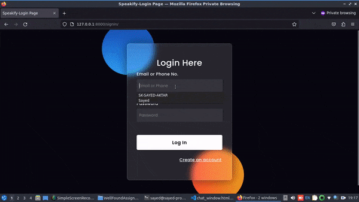

# Django, WebSockets, Connect People, Chat System

## Author: SK SAYED AKTAR

This is a platform that allows users to sign up and log in with their credentials, and then connect with other users based on shared interests (such as food, travel, movies, etc.) using a WebSocket connection.

## Table of Contents

- [Features](#features)
- [Installation](#installation)
- [Usage](#usage)

## Features

- Users can sign up and log in with their credentials.
- Users can be made online after entering the portal.
- Users can connect with other users based on shared interests using a WebSocket connection.

## Installation

To install this project, follow these steps:

1. Install the necessary dependencies by running `pip/pip3 install requirements.txt`.
2. Navigate to the root project directory and open your terminal.
3. Run the following command: `python3 manage.py makemigrations`.
4. Run the following command: `python3 manage.py migrate`.
5. Finally, run the following command: `python3 manage.py runserver`.

You're good to go!

## Usage

To use this project, sign up and log in with your credentials, and then select your interests. You will be connected with other users who share those interests using a WebSocket connection.

For a better understanding of how the project works, you can watch the demo video located inside the DemoVideo directory.

License

This project is licensed under the Apache License, Version 2.0.
